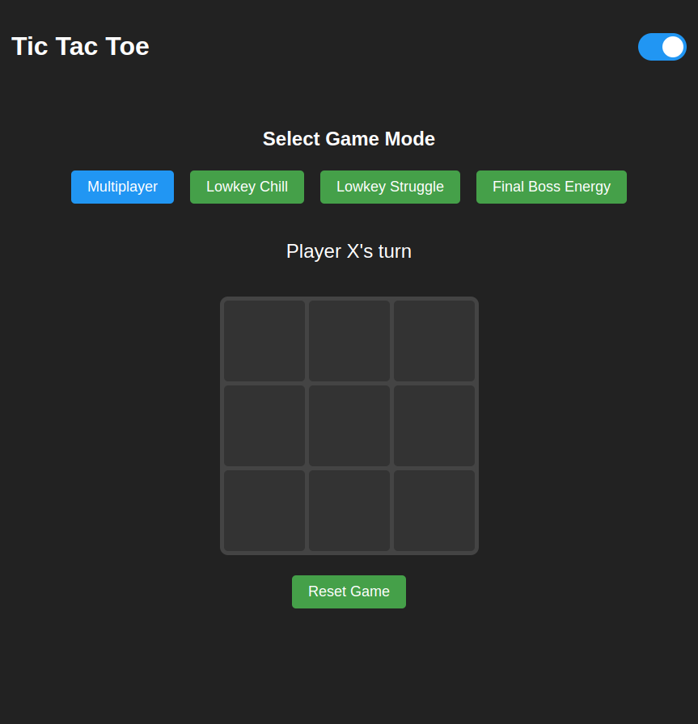

# Tic Tac Toe Game

A modern, responsive Tic Tac Toe game built with HTML, CSS, and vanilla JavaScript. Features multiple AI difficulty levels and a dark/light theme toggle.

## Features
- **Single-player and multiplayer modes**
- **Three AI difficulty levels:**
  - **Lowkey Chill:** Casual gameplay with random strategy
  - **Lowkey Struggle:** Intermediate AI with basic strategy
  - **Final Boss Energy:** Unbeatable AI using the minimax algorithm
- **Dark/light theme toggle**
- **Responsive design**
- **No dependencies**

## Demo
Watch the game in action:
<video controls width="640">
  <source src="demo.webm" type="video/webm">
  Your browser does not support the video tag. Please download the video to view it.
</video>

## Technology Stack
- **HTML5**
- **CSS3**
- **Vanilla JavaScript (ES6+)**

## Implementation Details
- Object-oriented design using ES6 classes
- Minimax algorithm for unbeatable AI
- CSS variables for theme switching
- Responsive grid layout